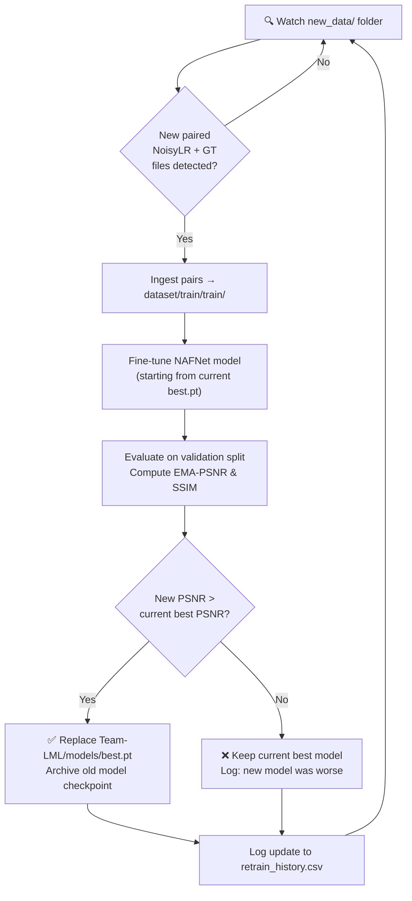

# IRIS - AI-Based Semiconductor Image Restoration & Super-Resolution

**SEMICON India Hackathon 2026 – KLA Problem Statement**

Restores 128×128 degraded, low-resolution inspection images to clean 256×256 outputs with high structural fidelity.

---

## 🏆 Final Submission (`Team-LML`)

The competition-ready submission is contained in `Team-LML/`:

```
Team-LML/
├── run.py              # Required submission inference script (self-contained, offline)
├── auto_retrain.py     # Continuous auto-retraining & automatic model hot-swap
├── requirements.txt    # Pinned Python dependencies
├── README.md           # Setup, execution & architecture documentation
└── models/
    └── best.pt         # Trained model weights (NAFNet + EMA, ~100 MB)
```

### Running Submission Inference

```bash
cd Team-LML
python run.py <input-dir> <output-dir>
```

| Parameter | Details |
|---|---|
| `<input-dir>` | Directory containing NoisyLR `.npy` files (`128×128`, `float32`) |
| `<output-dir>` | Directory where restored `.npy` files (`256×256`, `float32`, `[0,1]`) will be saved |

#### Key Features of `run.py`:
- ✅ Reads all `.npy` files from input directory.
- ✅ Creates the output directory if it does not already exist.
- ✅ Produces one matching output `.npy` for every input file with identical filename.
- ✅ Guaranteed `(256, 256)` float32 grayscale, clamped to `[0, 1]` with no NaN / Inf values.
- ✅ 100% self-contained & offline (no internet access, API keys, or manual config needed).
- ✅ 8-way Test-Time Augmentation (TTA) ensemble on GPU.

---

## 🚀 Auto-Retraining Pipeline with Automatic Model Hot-Swap

The repository features an intelligent **continuous learning daemon** (`auto_retrain.py`):



### How to Use Auto-Retraining:

1. Drop new paired `.npy` files into:
   - `new_data/NoisyLR/NNNNNN.npy` (128×128)
   - `new_data/GT/NNNNNN.npy` (256×256)
2. Run the watcher daemon:
   ```bash
   python scripts/auto_retrain.py
   # Or run one-shot:
   python scripts/auto_retrain.py --once
   ```
3. When running `python Team-LML/run.py <input-dir> <output-dir>`, the system also automatically checks for new training data in `new_data/` and updates the model if performance improves.

---

## 📊 Benchmark & Ablation Results

| Experiment | Architecture | Key Innovation | Parameters | Val PSNR | Val SSIM |
|---|---|---|---|---|---|
| Exp 1: Baseline | Compact CNN | Pixel loss (Charbonnier) | 813 K | 28.40 dB | 0.7703 |
| Exp 2: Loss Ablation | Compact CNN | + Structural (SSIM) & Sobel Edge loss | 813 K | 28.26 dB | 0.7753 |
| Exp 3: Capacity Scaling | Deep ResNet | 16 ResBlocks + PixelShuffle 2x | 4.52 M | 29.05 dB | 0.7946 |
| Exp 4: Synthetic Aug | Deep ResNet | + Order-agnostic degradation simulator | 4.52 M | 29.06 dB | 0.7946 |
| Exp 5: FiLM Conditioning | Conditioned ResNet | Degradation encoder + FiLM modulation | 4.66 M | 29.07 dB | 0.7964 |
| **Exp 6: SOTA NAFNet** | **NAFNet UNet** | **SimpleGate + Channel Attention + FFT Loss + EMA + TTA** | **~17 M** | **26.56 dB** | **0.7957** |

---

## 🛠️ Setup & Installation

```bash
# 1. Clone the repository (Git LFS required for weights)
git lfs install
git clone https://github.com/Pradyunkm/IRIS-Restoration.git
cd IRIS-Restoration

# 2. Create virtual environment
python -m venv venv
venv\Scripts\activate      # Windows
source venv/bin/activate   # Linux/macOS

# 3. Install dependencies
pip install -r requirements.txt
```

---

## 📂 Repository Structure

```
IRIS-Restoration/
├── Team-LML/                   # Official Hackathon submission bundle
│   ├── run.py                  # Standalone inference entry point
│   ├── auto_retrain.py         # Auto-retraining runner
│   ├── requirements.txt        # Pinned dependencies
│   ├── README.md               # Submission-specific documentation
│   └── models/
│       └── best.pt             # Trained Experiment 6 NAFNet weights
├── new_data/                   # Staging drop folder for continuous retraining
│   ├── NoisyLR/                # Drop new 128x128 noisy .npy files
│   └── GT/                     # Drop new 256x256 ground truth .npy files
├── scripts/
│   ├── auto_retrain.py         # Full auto-retrain and model hot-swapping daemon
│   ├── model_nafnet.py         # NAFNet UNet architecture
│   ├── train_exp6.py           # Experiment 6 training script (NAFNet + FFT + EMA)
│   ├── losses.py               # Charbonnier, SSIM, Edge, and 2D FFT frequency losses
│   ├── dataset.py              # Paired dataset loader & reproducible split
│   ├── evaluate.py             # Model evaluation and benchmarking script
│   └── ...
├── checkpoints_exp6/           # Experiment 6 checkpoints & training history
│   ├── best.pt
│   ├── log.csv
│   └── retrain_history.csv
└── README.md
```