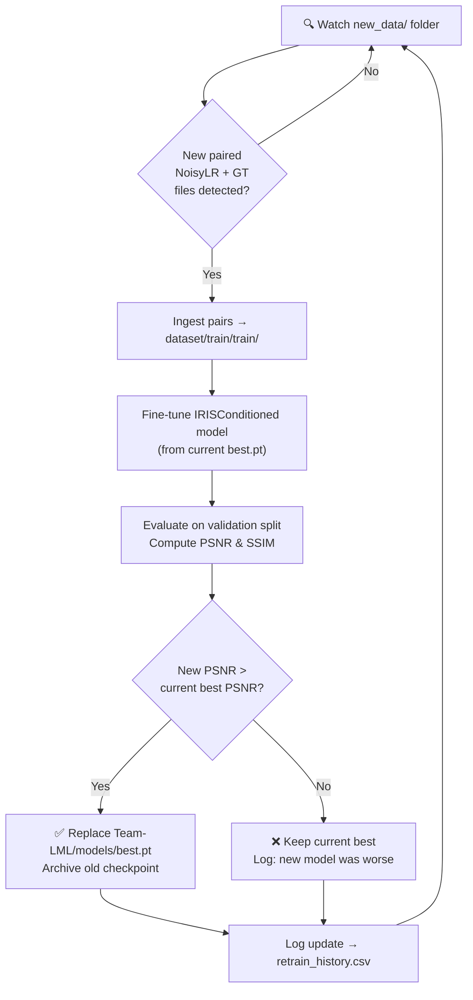

<h1 align="center">
  <br>
  🔬 IRIS — AI-Based Semiconductor Image Restoration
  <br>
</h1>

<p align="center">
  <strong>SEMICON India Hackathon 2026 · KLA Problem Statement</strong>
</p>

<p align="center">
  
  
  
  
</p>

<p align="center">
  Restores degraded, low-resolution <strong>128×128</strong> semiconductor inspection images to clean, high-fidelity <strong>256×256</strong> outputs — entirely offline, with 8-way TTA and automatic continuous retraining.
</p>

---

## 📋 Table of Contents

- [Overview](#-overview)
- [Final Submission](#-final-submission-team-lml)
- [Running Inference](#-running-inference)
- [Auto-Retraining Pipeline](#-auto-retraining-pipeline)
- [Experiment Benchmark](#-experiment-benchmark--ablation)
- [Architecture Deep-Dive](#-architecture-deep-dive)
- [Loss Functions](#-loss-functions)
- [Setup & Installation](#️-setup--installation)
- [Repository Structure](#-repository-structure)
- [Troubleshooting](#-troubleshooting)

---

## 🔭 Overview

IRIS (Image Restoration for Inspection Systems) solves a **joint denoising + 2× super-resolution** problem on real semiconductor wafer inspection images. Each input is a `128×128` float32 `.npy` array (noisy, low-resolution scan). The goal is to recover a `256×256` float32 output with maximum structural fidelity, measured by PSNR and SSIM.

The solution went through **five iterative experiments**, starting from a compact CNN baseline and culminating in a **FiLM-conditioned ResNet** (Experiment 5) — the final submission model.

---

## 🏆 Final Submission (`Team-LML`)

The competition-ready submission lives in `Team-LML/`:

```
Team-LML/
├── run.py              # Standalone inference entry point (self-contained, offline)
├── auto_retrain.py     # Continuous auto-retraining & model hot-swap runner
├── requirements.txt    # Pinned Python dependencies
├── README.md           # Submission-specific documentation
└── models/
    └── best.pt         # Trained IRISConditioned weights (~18 MB, Git LFS)
```

---

## 🚀 Running Inference

### Prerequisites

```bash
pip install -r Team-LML/requirements.txt
# Core: torch==2.5.1  numpy==1.26.4  Pillow==11.3.0  tqdm==4.67.1
```

### Run

```bash
python Team-LML/run.py <input-dir> <output-dir>
```

| Parameter | Details |
|---|---|
| `<input-dir>` | Directory of `NNNNNN.npy` files — shape `(128, 128)`, `float32` |
| `<output-dir>` | Created automatically; receives `NNNNNN.npy` — shape `(256, 256)`, `float32`, clamped to `[0, 1]` |

```bash
# Example
python Team-LML/run.py dataset/Test_NoisyLR/ results/output/
```

#### What `run.py` guarantees

| Feature | Detail |
|---|---|
| **Any scale** | Processes 400, 3200, or any number of `.npy` files |
| **Output parity** | Exactly one output per valid input; filenames preserved |
| **Safe output** | `float32`, `(256, 256)`, `[0, 1]`-clamped, zero NaN/Inf |
| **GPU TTA** | 8-way geometric test-time augmentation ensemble |
| **Fully offline** | No internet, API keys, or manual configuration required |
| **Auto-retrain** | Checks `new_data/` for fresh labeled pairs and fine-tunes before returning |

> Skip auto-retraining: `python Team-LML/run.py <in> <out> --no_auto_train`  
> Skip TTA (faster): `python Team-LML/run.py <in> <out> --no_tta`

---

## 🔄 Auto-Retraining Pipeline

IRIS features an intelligent **continuous learning daemon** that watches for new labeled data, fine-tunes the model, and hot-swaps `best.pt` only when the new model improves PSNR:



### Usage

1. **Drop new paired data** into the staging folder:
   ```
   new_data/NoisyLR/NNNNNN.npy   ← 128×128 noisy input
   new_data/GT/NNNNNN.npy        ← 256×256 clean ground truth
   ```

2. **Run the watcher daemon** (loops indefinitely, polls every 60 s):
   ```bash
   python scripts/auto_retrain.py
   ```

3. **One-shot mode** (ingest & retrain once, then exit):
   ```bash
   python scripts/auto_retrain.py --once
   ```

4. `run.py` also auto-triggers retraining before inference if new data is present.

---

## 📊 Experiment Benchmark & Ablation

Each experiment stacks one new contribution on top of the previous winner:

| # | Architecture | Key Innovation | Parameters | Val PSNR | Val SSIM |
|---|---|---|---|---|---|
| **Exp 1** | Compact CNN | Charbonnier pixel loss baseline | 813 K | 28.40 dB | 0.7703 |
| **Exp 2** | Compact CNN | + Structural (SSIM) & Sobel Edge loss | 813 K | 28.26 dB | 0.7753 |
| **Exp 3** | Deep ResNet | 16 ResBlocks + PixelShuffle 2× | 4.52 M | 29.05 dB | 0.7946 |
| **Exp 4** | Deep ResNet | + Order-agnostic degradation simulator | 4.52 M | 29.06 dB | 0.7946 |
| **Exp 5 ✅** | **FiLM Conditioned ResNet** | **Degradation encoder + FiLM modulation** | **4.66 M** | **29.07 dB** | **0.7964** |

> Exp 5 is the **best and final model** — highest PSNR and SSIM across all experiments with an efficient 4.66 M parameter footprint.

---

## 🏗️ Architecture Deep-Dive

### IRISConditioned (`model_conditioned.py`) — Experiment 5

The model combines a **degradation-aware encoder** with a **FiLM-modulated ResNet** backbone and a **PixelShuffle 2× upsample head**.

```
Input  (B, 1, 128, 128)
       │
       ├──────────────────────────────────────────────┐
       │                                              │
  ┌────▼─────────────┐                         ┌─────▼──────┐
  │ DegradationEncoder│                         │  Bilinear  │
  │  Conv×3 + GAP     │                         │  2× Upsamp │
  │  → embed (B, 32)  │                         └─────┬──────┘
  └────┬─────────────┘                                │  (global residual)
       │ embedding                                    │
  ┌────▼─────────────────────────────────────┐        │
  │  Stem Conv → 16 × FiLMResidualBlock      │        │
  │  Each block: Conv×2 + FiLM(γ,β) + skip  │        │
  │  Channels: 112                           │        │
  └────┬─────────────────────────────────────┘        │
       │                                              │
  ┌────▼──────────────────┐                           │
  │  Pre-upsample Conv    │                           │
  │  PixelShuffle 2×      │  128×128 → 256×256        │
  │  Post-upsample ResBlk │                           │
  └────┬──────────────────┘                           │
       │                                              │
  ┌────▼───────────────┐                              │
  │  Refine head        │  Conv → ReLU → Conv(→1ch)  │
  └────┬───────────────┘                              │
       │ correction                                   │
       └──────────────────  +  ───────────────────────┘
  Output (B, 1, 256, 256)
```

#### Key Building Blocks

| Block | Purpose |
|---|---|
| **DegradationEncoder** | 3-layer CNN + GAP + Linear → 32-dim embedding encoding the input's noise/blur profile |
| **FiLMResidualBlock** | Standard ResBlock whose features are modulated by per-channel scale (γ) and shift (β) derived from the degradation embedding |
| **PixelShuffleUpsample** | Checkerboard-free 2× spatial upsampling via PixelShuffle |
| **ResidualBlock** | Standard post-upsample refinement block |
| **Global Residual** | Bilinear 2× upsample of raw input added to the learned correction — ensures smooth baseline output |

#### Why FiLM Conditioning Works

Traditional restoration networks apply the same processing to every image regardless of degradation severity. FiLM lets the network **adapt its residual block behaviour** based on what the `DegradationEncoder` detects from the specific input. This is the key gain over Exp 3/4 — the network learns different internal processing strategies for differently-degraded inputs.

---

## 📐 Loss Functions

Experiments 2–5 use a combination of spatial losses (`losses.py`):

$$L = \lambda_{\text{pixel}} \cdot L_{\text{Charb}} + \lambda_{\text{struct}} \cdot L_{\text{SSIM}} + \lambda_{\text{edge}} \cdot L_{\text{Edge}}$$

| Term | Formula | Weight (Exp 5) | Purpose |
|---|---|---|---|
| **Charbonnier** | $\sqrt{(p-t)^2 + \varepsilon^2}$ | 1.0 | Robust pixel fidelity (outlier-tolerant MSE) |
| **SSIM** | $1 - \text{SSIM}(p, t)$ | 0.2 | Structural / perceptual similarity |
| **Edge (Sobel)** | $\|\nabla p - \nabla t\|_1$ | 0.3 | Penalises edge blur directly |

---

## 🛠️ Setup & Installation

### Requirements

- Python ≥ 3.10
- CUDA-capable GPU (≥ 4 GB VRAM recommended; tested on RTX 4050 6 GB)
- Git LFS (for model weights)

### Steps

```bash
# 1. Clone (Git LFS required for .pt weights)
git lfs install
git clone https://github.com/Pradyunkm/IRIS-Restoration.git
cd IRIS-Restoration

# 2. Create virtual environment
python -m venv venv
venv\Scripts\activate        # Windows
# source venv/bin/activate   # Linux / macOS

# 3. Install dependencies
pip install -r requirements.txt

# 4. (Optional) Install submission-pinned deps
pip install -r Team-LML/requirements.txt
```

### Training from Scratch

```bash
# Experiment 5 — FiLM-conditioned ResNet (best model)
python scripts/train_exp5.py \
    --data_root dataset/train/train \
    --epochs 100 \
    --batch_size 8

# Quick smoke-test (5 epochs)
python scripts/train_exp5.py \
    --data_root dataset/train/train \
    --epochs 5 \
    --batch_size 8
```

| Argument | Default | Description |
|---|---|---|
| `--data_root` | *(required)* | Folder with `NoisyLR/` and `GT/` subfolders |
| `--epochs` | 100 | Training epochs |
| `--batch_size` | 8 | Batch size |
| `--lr` | 1e-4 | Adam learning rate |
| `--channels` | 112 | ResNet base channel count |
| `--num_res_blocks` | 16 | Number of FiLM residual blocks |
| `--embed_dim` | 32 | Degradation embedding dimension |
| `--checkpoint_dir` | `checkpoints_exp5` | Where to save `.pt` and `log.csv` |

---

## 📂 Repository Structure

```
IRIS-Restoration/
│
├── Team-LML/                       # 🏆 Official hackathon submission bundle
│   ├── run.py                      # Main inference entry point
│   ├── auto_retrain.py             # Auto-retrain runner for submission
│   ├── requirements.txt            # Pinned runtime dependencies
│   ├── README.md                   # Submission documentation
│   └── models/
│       └── best.pt                 # Trained IRISConditioned weights (Git LFS, ~18 MB)
│
├── scripts/                        # Research & training code
│   ├── model_conditioned.py        # IRISConditioned: FiLM-modulated ResNet (Exp 5) ✅
│   ├── model.py                    # Compact CNN baseline (Exp 1–2)
│   ├── train_exp5.py               # Exp 5 training (FiLM conditioning)
│   ├── train_exp4.py               # Exp 4 training (degradation sim)
│   ├── train_exp3.py               # Exp 3 training (deep ResNet)
│   ├── train_exp2.py               # Exp 2 training (loss ablation)
│   ├── train.py                    # Exp 1 baseline training
│   ├── losses.py                   # Charbonnier + SSIM + Edge losses
│   ├── dataset.py                  # Paired dataset loader + val split
│   ├── augmented_dataset.py        # Geometric augmentation wrapper
│   ├── degradation_simulator.py    # Synthetic degradation augmentation
│   ├── evaluate.py                 # Evaluation & benchmarking
│   ├── auto_retrain.py             # Full auto-retrain daemon (hot-swap)
│   ├── compute_clean_metrics.py    # Metric computation utilities
│   ├── generate_ablation_report.py # Ablation summary report generator
│   ├── dataset_audit.py            # Dataset integrity checker
│   ├── inspect_outliers.py         # Outlier inspection tool
│   ├── visualize_pairs.py          # Side-by-side pair visualization
│   └── visualize_predictions.py   # Prediction visualization
│
├── checkpoints_exp5/               # Experiment 5 checkpoints (Git LFS) ✅ Best
│   ├── best.pt                     # Best checkpoint
│   ├── last.pt                     # Latest epoch checkpoint
│   └── log.csv                     # Per-epoch train/val metrics
│
├── checkpoints/                    # Exp 1 checkpoints
├── checkpoints_exp2/               # Exp 2 checkpoints
├── checkpoints_exp3/               # Exp 3 checkpoints
├── checkpoints_exp4/               # Exp 4 checkpoints
│
├── dataset/                        # Training & test data (not tracked by git)
│   └── train/train/
│       ├── NoisyLR/                # 128×128 degraded inputs
│       └── GT/                     # 256×256 clean ground truth
│
├── new_data/                       # Drop zone for continuous retraining
│   ├── NoisyLR/                    # New 128×128 noisy .npy files
│   └── GT/                         # New 256×256 GT .npy files
│
├── results/                        # Inference output directory
├── requirements.txt                # Top-level dev dependencies
├── .gitattributes                  # Git LFS tracking rules
└── README.md
```

---

## ❓ Troubleshooting

**Q: `run.py` produced fewer outputs than expected.**  
A: `run.py` skips files that are not valid `(128, 128)` float32 arrays or not named `NNNNNN.npy`. Check the console — it prints a warning for every skipped file. The count of outputs always equals the count of valid inputs.

**Q: Auto-retrain didn't trigger when I ran `run.py`.**  
A: The trigger checks `new_data/NoisyLR/` and `new_data/GT/` for matched `.npy` pairs. If both subfolders are empty or unmatched, retraining is correctly skipped. Drop paired files there and re-run. Use `--no_auto_train` to bypass the check entirely.

**Q: `WARNING: Could not import auto_retrain module`.**  
A: Ensure `scripts/auto_retrain.py` is present and `torch`, `numpy`, and `tqdm` are installed (`pip install -r Team-LML/requirements.txt`). Pass `--no_auto_train` to skip.

**Q: CUDA out of memory during training.**  
A: Reduce `--batch_size` to 4, or lower `--channels` to 64 and `--num_res_blocks` to 8 for a smaller model (~1 M params) at some cost to quality.

**Q: Git LFS — weights not downloading.**  
A: Run `git lfs install` before cloning, or fetch them manually: `git lfs pull`.

---

## 📄 License

This repository is submitted as part of SEMICON India Hackathon 2026 (KLA Problem Statement) by **Team LML**. All code is original unless attributed otherwise in source file headers.

---

<p align="center">Made with ❤️ by <strong>Team LML</strong> · SEMICON India Hackathon 2026</p>